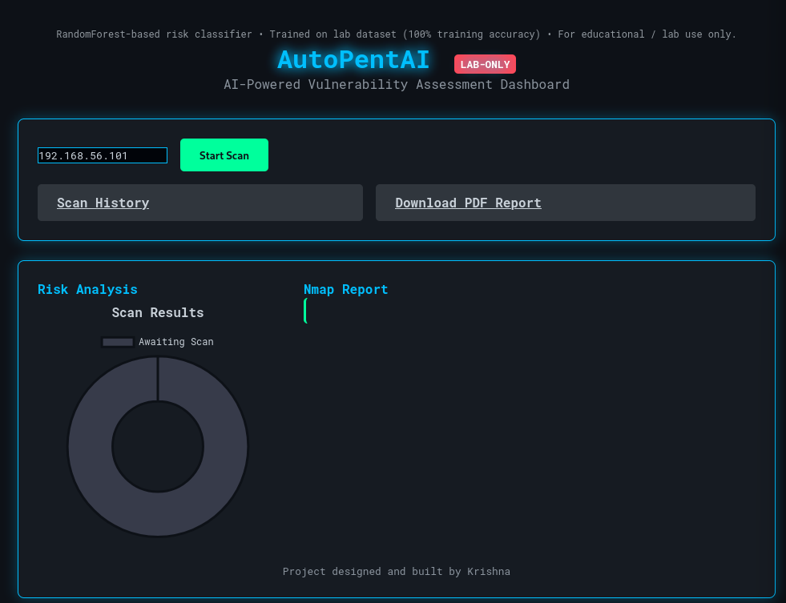
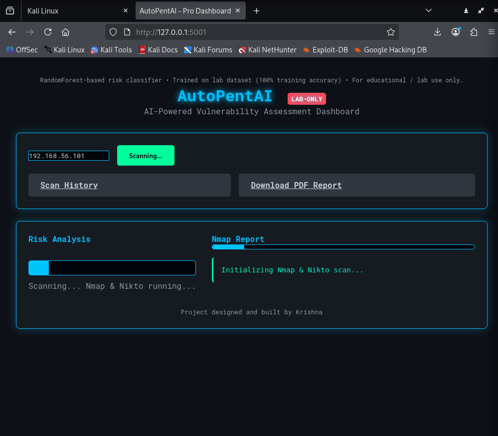
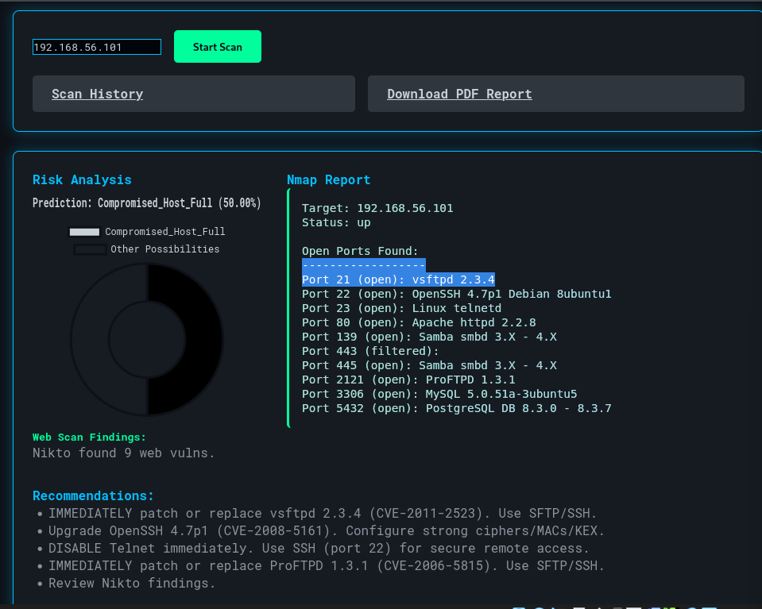
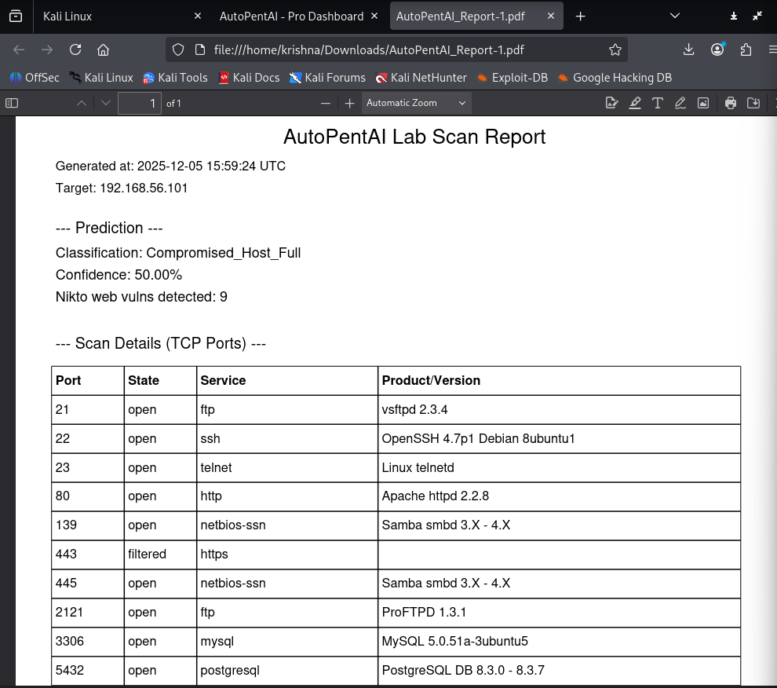
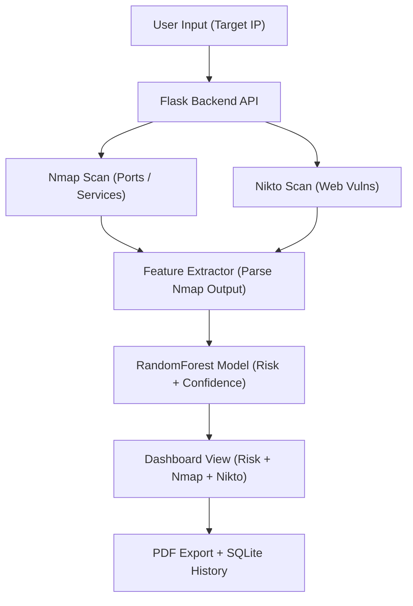

# AutoPentAI – AI Powered Vulnerability Assessment Dashboard

  
  
  
  

AutoPentAI is a **full-stack AI-driven vulnerability scanning tool** that automates:
- Nmap Port & Service Scanning  
- Nikto Web Vulnerability Scanning  
- AI-Based Risk Prediction (RandomForest)  
- Real-time Dashboard Visualization  
- One-click PDF Reporting  
- Scan History Logging  

Designed for **virtual lab environments** such as Metasploitable2, DVWA, Juice Shop, and private networks.

---

## 📸 Screenshots

### 🔹 Dashboard (Idle)

### 🔹 Scanning (Nmap + Nikto Running)

### 🔹 Result Summary

### 🔹 PDF Export

---

## 🚀 Features

- **Automated Recon** → Nmap + Nikto in a single click  
- **AI Risk Prediction** → RandomForest classifier  
- **Dark Themed Dashboard** → Live progress + charts  
- **PDF Reporting** → Clean professional summary  
- **Scan History (SQLite)** → Stores all previous scans  
- **Modular Backend** → Flask + Python + ML pipeline  
- **Safe Lab Mode** → Only internal / virtual networks allowed  

---

## 🧠 System Architecture

🛠 Installation (Kali/Ubuntu)
1. Clone the repository
git clone https://github.com/KreeeDox/AutoPentAI-Scanner.git
cd AutoPentAI-Scanner

2. Install dependencies
sudo apt update
sudo apt install -y python3-venv nmap nikto docker.io docker-compose

3. Environment setup
python3 -m venv venv
source venv/bin/activate
pip install -r requirements.txt

4. Start the tool
./start.sh

Open browser:

http://127.0.0.1:5001

🖥️ Usage

1️⃣ Start the tool
2️⃣ Enter target IP (example: 192.168.56.101 for Metasploitable2)
3️⃣ Click Start Scan
4️⃣ View:

Risk Level

Confidence %

Nmap scan

Nikto findings
5️⃣ Export PDF
6️⃣ Check previous scans in Scan History

📂 Recommended Lab Setup

Use virtual lab machines:

Metasploitable 2

Metasploitable 3

DVWA (Docker)

Juice Shop (Docker)

Network mode:

Scanner VM → NAT + Host-Only

Target VM → Host-Only

👨‍💻 Author

Krishna (KreeeDox)

A cybersecurity enthusiast building AI-powered tools for research and learning.

